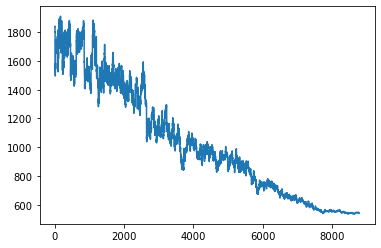

# Simulated Annealing Algorithm (SA) 🌡️

## Introduction

This is an example of Simulated Annealing Algorithm. The problem is to find an optimal solution for the Travelling Salesman Problem (TSP). The algorithm is tested on a set of *n* cities.

## Dependencies

* [pandas](https://pandas.pydata.org/)
* [numpy](https://numpy.org/)
* [matplotlib](https://matplotlib.org/)
* [openpyxl](https://openpyxl.readthedocs.io/en/stable/)
* [geopy](https://geopy.readthedocs.io/en/stable/)
* [geocoder](https://geocoder.readthedocs.io/)

## How to run the code
It is recommended to run the code in a virtual environment.

1. To create a virtual environment, I recommend:

```
python install -r requirements.txt
```

But you can install the libraries manually if you want. Only be sure to install the libraries in the same version as the ones in the requirements.txt file and use **python 3.11**.

2. Run the code

There are two notebooks that you can run:

a) `generate-distances.ipynb`

b) `simulated-annealing.ipynb`

You must run `generate-distances.ipynb` first to generate the distances between the cities. Then, you can run `simulated-annealing.ipynb` to find the optimal solution.

In the `generate-distances.ipynb` feel free to change the name of the cities if you want. This example uses some cities of Mexico, but you can adapt it to your needs and even increase o decrease the number of cities; just be consious that increasing the number of cities will increase the time to create the matrix of distances.

## 1. The Travelling Salesman Problem contextualized 

The TSP is a well-known problem in computer science. 

The fundamental problem involves determining the *shortest possible route* that allows for visiting each city exactly once before returning to the origin city. The problem is posed with a given list of citites each pair with the respective distances between them. 

The TSP is frequantly solved using the Simulated Annealing approach, which leverages *combinatorial optimization* and incorporates elements of *stochastic methods*. 

The subsequent sections will provide a brief overview of these concepts.

## 2. Combinatorial Optimization

In essence, a *combinatorial optimization* problem revolves around a set of *potential solutions*, coupled with a *cost function* that ascribes a cost (expressed as a numerical value) to each of these solutions. 

The methods that solve combinatorial optimización problems can be divided into two groups: *deterministic and stochastic.* In this context, a stochastic method has been employed, characterized by the use of statistical data with stochastic parameters. These parameters exert a significant influence over the optimization process, allowing it to solve the problem from a probabilistic perspective [[1]](https://www.sciencedirect.com/science/article/pii/S187705091930119X).

Simulated annealing is a special case of a more general class of *adaptive heuristics* for combinatorial optimization. 

The term *adaptive* means that the algorithm parameters are adjusted during the optimization process. This modification could be done by some learning mechanism or by user interaction [[2]](https://www.researchgate.net/publication/4218709_Simulated_Annealing_and_Combinatorial_Optimization).

The term *heuristic*, in this context, means that the algorithm does not guarantee to find the optimal solution, but it is fast and it finds a good solution in most cases [[2]](https://www.researchgate.net/publication/4218709_Simulated_Annealing_and_Combinatorial_Optimization).

## 3. Stochastic simulation and Monte Carlo

As I mentioned before, methods that solve combinatorial optimización problems can be *deterministic and stochastic*. Here, an stochastic method known as *Monte Carlo* is used.

The Monte Carlo method is a key component in two steps of the SA:

**a) Generating new solutions.** SA uses random sampling to generate new potential solutions in the neghborhood of the current solution.

**b) Decision making.** When a new solution is generated, it's not always accepted. The Monte Carlo methos is used to decide whether to accept or reject the new solution.


With Monte Carlo comes in mind the *theorem of central limit*, which states that the sum of a large number of independent random variables is approximately normally distributed. Here this is important because in code we're gonna have a `for` loop that will going to repeat as many times as we want. So, the more times we repeat the loop, the more the distribution of the solutions will be normal. This is useful to understand the behavior and outcomes of the method. 

## 4. Intuition behind the Simulated Annealing

The Simulated Annealing Algorithm is based on the physical process of annealing, which is a process of heating and cooling a material to alter its physical properties due to the changes in its internal structure.

The algorithm is based on the following analogy from termodynamics:

Basically, you will have a high temperature at the beginning and then you will cool down the system. The idea is that when you have a high temperature, the particles of a system will have a lot of energy and they will move randomly. But, as you cool down the system, the particles will have less energy and they will move less randomly. This can be seen if you plot the energy of the system vs the temperature. Below I leave an example of this. 

## 5. The Algorithm

In this example, the algorithm is used to **minimize** the cost of the solution. The algorithm is based on the following steps:

#### 5.1. Initialization
Given an arbitrary solution, local optimization attemps to improve on that solution by making small changes to it. The algorithm starts with an initial solution, which is generated randomly {Initial solution = A}.


#### 5. 2. Initialize heuristic parameters
The algorithm initializes the heuristic parameters, which are used to control the search process. These parameters are the *temperature* and the *cooling rate*.

#### 5.3. Generate a new solution

Here is when math and statistics come in. 

The algorithm generates a new solution by making a small change to the current solution. The new solution is generated by randomly selecting a city and swapping it with another city in the solution and it is called "neighborhood" of A. 
Every single time we generate a new solution, we calculate the cost of the new solution.

#### 5.4. How to decide if we move to the new solution or not?

The algorithm decides whether to move to the new solution or not. To do that, we have two possible cases:

* If the new solution is better than the current solution, the algorithm moves to the new solution.

* But, if the new solution is worse than the current solution, the algorithm comes with probability... and, how is that decision made?

Well, this is the part which uses probability because the algorithm gonna **make a decision** to keep the new solution or not based on the **probability of accepting the error**.

In code, we're gonna have an object called `delta_e` which is the difference between the cost of the new solution and the cost of the current solution. `delta_e` is understood as the error.

This means that if the error is negative, the new solution is better than the current solution and we're gonna keep the new solution. But, if the error is positive, the new solution is worse than the current solution.

If the error is positive, I'm gonna start to play with the probability of accepting the error. Here, we're gonna use the "Boltzmann probability distribution". 

The numerator is the error (delta_e) and denominator is the temperature (T). So, here comes the importance of the temperature because, it is the parameter that we're gonna use to control the probability of accepting the error.

The temperature is initialized at the beginning of the algorithm and it is updated at the end of each iteration. The temperature is updated by multiplying it by the cooling rate. This means that in our first iterations, the temperature is gonna be high and the probability of accepting the error is gonna be high. But, as we move forward in the algorithm, the temperature is gonna be lower and the probability of accepting the error is gonna be lower.

But then we have the exponential function (q) which is the probability of accepting the error; and, (p) which is the distribution of the probability between 0 and 1. 

#### 5.5. Cooling the temperature

Every time the for loop is executed, the temperature is updated. In this case the have this formula: `T = 1000/(1+(t))`. But, notice that there are some other that you can use depending on the problem that you're trying to solve.

#### 5.6. Stop criteria

The algorithm stops when the temperature is lower than a certain value. In this case, the algorithm stops when the temperature is lower than the value you set in `while T > 5`. Again, "5" it's a value that you can change depending on the problem that you're trying to solve.

#### A graph to illustrate the behavior expected from the algoritm 📉



This is a typical behavior we expect from the algorithm in case that we want to *minimize* the cost of the solution.
As we see from the graph, in x axis we have the number of iterations and in y axis we have the cost of the solution.

It's interesting to see that the behavior in the first iterations is very unstable. This is because the temperature is high and the probability of accepting the error is high. So, the algorithm is gonna accept the error even if the error is positive. But, as we move forward in the algorithm, the temperature is lower and the probability of accepting the error is lower. This is part of what I tried to explain in the previous intuition part so, I hope it helps you :)
## References 

[1] Grabusts, P., Musatovs, J., & Golenkov, V. (2018). The application of simulated annealing method for optimal route detection between objects. ICTE in Transportation and Logistics 2018 (ICTE 2018). Rezekne Academy of Technologies, Atbrivoshanas al. 115, Rezekne, LV-4601, Latvia & Belarusian State University of Informatics and Radioelectronics, Minsk, st. Platonov 39, Belarus.

[2] Nahar, S., Sahni, S., & Shragowitz, E. (1986). Simulated Annealing and Combinatorial Optimization. En Design Automation, 1986. 23rd Conference on. IEEE Xplore. DOI: 10.1109/DAC.1986.1586103.

[3] Johnson, D. S., Aragon, C. R., McGeoch, L. A., & Chevon, C. (1989). Optimization by simulated annealing: An experimental evaluation - Part 1, Graph partitioning. Operations Research, 37(6), 865-92.

## Contact
Patricia Munoz - munpaty@gmail.com


